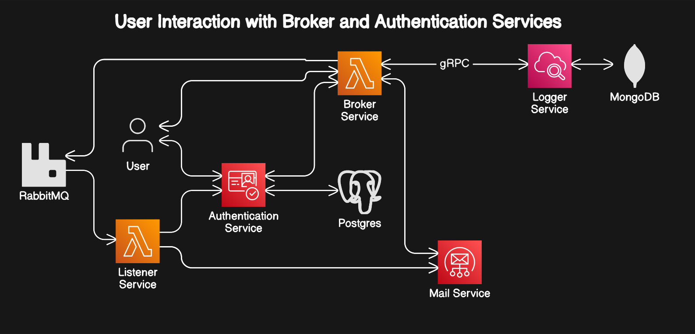

# Microservices Application Deployment

This repository contains the configuration files and deployment scripts for a microservices-based application using Kubernetes. The application consists of several services, including authentication, broker, front-end, listener, logger, mailer, MongoDB, RabbitMQ, and PostgreSQL.

TODO: front end is not clearly defined yet

## Services Overview

### Authentication Service

The authentication service handles user authentication and authorization. It uses a PostgreSQL database for user data storage.

### Broker Service

The broker service acts as an intermediary between different components of the application, facilitating communication and message passing. It is built using RabbitMQ.

### Listener Service

The listener service captures and processes incoming events and logs. It communicates with the logger service for storing event data.

### Logger Service

The logger service is responsible for storing and managing log entries in a MongoDB database. It exposes multiple ports for different communication protocols, including HTTP and RPC.

### Mailer Service

The mailer service enables sending email notifications. It uses the MailHog service for testing purposes and is configurable with environment variables.

### MongoDB

The MongoDB service provides a database for storing log entries.

### RabbitMQ

RabbitMQ is used as a message broker to enable communication between different services within the application.

### PostgreSQL

The PostgreSQL service provides a relational database for storing user authentication data.

## Deployment

The application is deployed using Kubernetes and Docker Compose. The `docker-compose.yaml` file defines the services and their configurations for local development. Kubernetes manifests (`*.yaml`) define the resources for each service, including deployments, services, and ingresses for production deployment.

## Contributing

Contributions are welcome! Please fork this repository and submit pull requests for any improvements, bug fixes, or new features.

